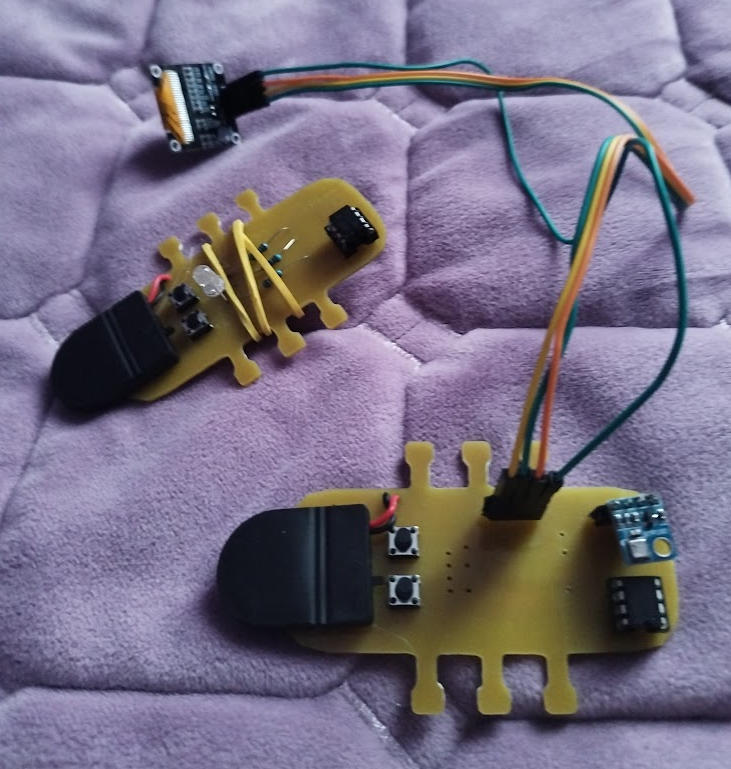
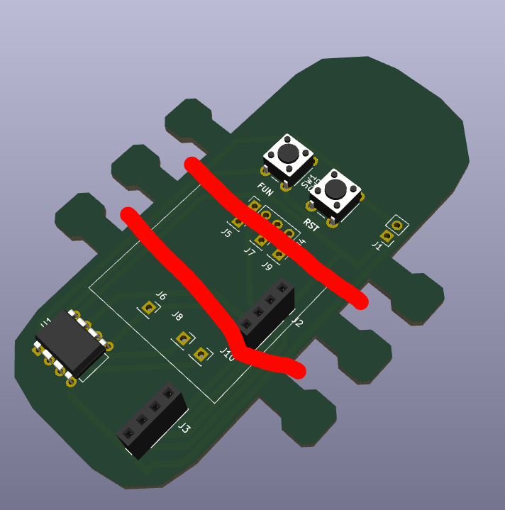
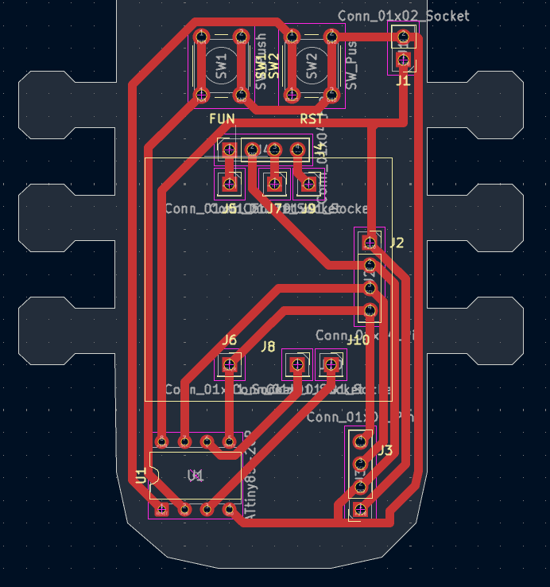
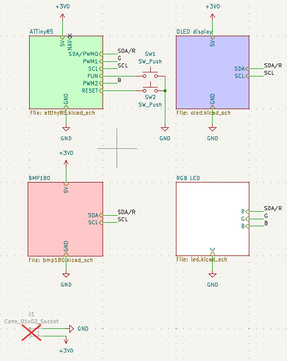

# atlice
attiny85-based multi-purpose lice hairclips

<small>[head image source](https://en.wiktionary.org/wiki/head)</small>

## what is this?
this is a hairclip that can be used as either a mood indicator, a tamagotchi, or a portable weather station. well, not a hairclip by itself -- a pcb that can be attached onto a hairclip with rubber bands. it has multiple firmware modes available, all of which let you use the device in their own unique ways. it is based on the attiny85 chip, which isn't too powerful but is more than enough for this.

## how do i use this?
first of all, get all the required components (listed in `bom.xml`, disregard components you don't need) and build it! the gerber files and the source project files are in this repo, too (see `kicad/`). here are some notes:
- get an SSD1306 display that a. works via i2c and b. has the power pin on the left. from what i could find, these also take 3V as the input just fine, which is perfect for our purposes since we use a CR2302 battery. (note: some sellers might send you the wrong type of display, like mine! please be aware of that)
- solder a 150Ohm resistor at J5-J6 and a 100Ohm resistor at J7-J8 and J9-J10.
- solder/attach the SSD1306 display facing inwards at J2, and the BMP180 temperature sensor also facing inwards at J3. the attiny85 goes at U1.
- attach the battery case at J1, with the top pin being the ground pin and the bottom pin being the +3V0 pin.

you can then attach it to a hairclip using small rubber bands with the grooves on the pcb (the "legs" of the louse).

once you have built it, flash the attiny85 with the appropriate firmware from `firmware/`. (note: if you want to permanently solder the attiny85 to the board, flash it before that! it'll be very hard to do it otherwise.)
then just turn on the battery and enjoy!!

### controls
|mode|FUN|RST|
|-|-|-|
|mood indicator|-|change color/mood|
|weather station|-|turn on|
|tamagotchi|play with|feed/turn on|

## why was this made?
i have an old mood indicator hairclip (inspired by a pi pico hot glued to a hairclip, which was gifted to me by a friend), which also has an attiny85. i built it around december of 2025, and wanted to push the concept of wearable hairclips even further ever since then. this is my next attempt, hopefully it's actually good!!

## credits
- zine background: https://www.dreamstime.com/illustration/bug-wallpaper.html